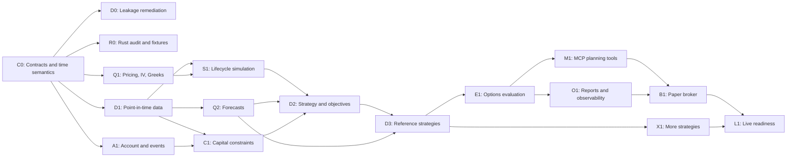

# Strategy-Agnostic Options MCP Delivery Plan

## Purpose

This directory converts the architecture in [`options_strategy_agnostic_mcp_spec_outline.md`](../architecture/options_strategy_agnostic_mcp_spec_outline.md) into parallel work packages and dependency-gated sprints.

The plan delivers a system that can use point-in-time options data to compare strategies such as a Friday-to-Monday short put and a 30-45 DTE cash-secured put, simulate their lifecycle and capital use, rank them under an explicit objective, and generate a reviewable MCP order intent.

## Planning Rules

- A sprint is a dependency unit, not necessarily a fixed calendar duration.
- Work inside a parallel group may start concurrently.
- A downstream package starts only when all listed dependencies meet their exit criteria.
- Python remains the orchestration and research language.
- Rust is used behind narrow interfaces only after Python/Rust parity tests exist.
- Historical and paper workflows precede live execution.
- No work package may bypass point-in-time, data-quality, review, or confirmation controls.

## Work Lanes

| Lane | Scope | Primary packages |
|---|---|---|
| A — Contracts and data | Typed domain objects, provider contracts, storage, quality | `data/`, `options/contracts.py`, `mcp/schemas.py` |
| B — Quantitative services | Pricing, IV, Greeks, surfaces, reusable forecasts | `options/pricing.py`, `forecasts/` |
| C — Simulation and capital | Fills, lifecycle, assignment, margin, portfolio accounting | `simulation/` |
| D — Strategies and decisions | Plug-ins, candidate filters, objectives, reference strategies | `strategies/`, `objectives/` |
| E — MCP and operations | MCP tools, plans, review, observability, broker integration | `mcp/`, reports, adapters |

## Dependency Matrix

Legend: `P` means a hard prerequisite. `S` means a soft dependency that may be mocked temporarily. `—` means no dependency.

| ID | Work package | C0 Contracts | D1 PIT data | Q1 Pricing | Q2 Forecasts | S1 Lifecycle | C1 Capital | D2 Strategy core | D3 Reference strategies | M1 MCP planning | Sprint |
|---|---|---:|---:|---:|---:|---:|---:|---:|---:|---:|---:|
| C0 | Canonical contracts and time semantics | — | — | — | — | — | — | — | — | — | 1 |
| D0 | Leakage remediation | S | — | — | — | — | — | — | — | — | 1 |
| R0 | Rust kernel audit and parity fixtures | S | — | — | — | — | — | — | — | — | 1 |
| D1 | Point-in-time option data foundation | P | — | — | — | — | — | — | — | — | 2 |
| Q1 | Pricing, IV, Greeks, and surface baseline | P | S | — | — | — | — | — | — | — | 2 |
| A1 | Account, rates, dividends, and events | P | S | — | — | — | — | — | — | — | 2 |
| S1 | Option fill and lifecycle engine | P | P | P | — | — | S | — | — | — | 3 |
| Q2 | Horizon-indexed forecast service | P | P | S | — | — | — | — | — | — | 3 |
| C1 | Capital and portfolio constraint engine | P | S | — | — | — | — | — | — | — | 3 |
| D2 | Strategy, candidate, and objective framework | P | P | P | S | P | P | — | — | — | 4 |
| D3 | Weekend and 30-45 DTE strategies | P | P | P | P | P | P | P | — | — | 5 |
| E1 | Walk-forward options evaluation | P | P | P | P | P | P | P | P | — | 5 |
| M1 | MCP market, research, and planning tools | P | P | P | P | P | P | P | P | — | 6 |
| O1 | Trade-plan reporting and observability | P | P | S | S | P | P | P | P | S | 6 |
| B1 | Broker-aware paper execution | P | S | — | — | P | P | P | P | P | 7 |
| X1 | Collar and vertical strategies | P | P | P | S | P | P | P | P | S | 8 |
| L1 | Optional live-readiness hardening | P | P | P | P | P | P | P | P | P | 8 |

## Parallelization Graph



## Critical Path

```text
C0 canonical contracts
  -> D1 point-in-time option data
  -> Q1 pricing baseline
  -> S1 lifecycle simulation
  -> D2 strategy/objective framework
  -> D3 reference strategies
  -> E1 walk-forward evaluation
  -> M1 MCP trade planning
  -> B1 paper execution
```

Forecasting (`Q2`), capital/account modeling (`A1`/`C1`), Rust parity (`R0`), and reporting (`O1`) are parallel lanes that merge into this path at explicit gates.

## Sprint Index

| Sprint | Outcome | Parallel groups | File |
|---|---|---:|---|
| 1 | Correctness baseline and stable contracts | 4 | [sprint1.md](sprint1.md) |
| 2 | Queryable options data and trusted pricing baseline | 3 | [sprint2.md](sprint2.md) |
| 3 | Lifecycle, forecasts, and capital calculations | 3 | [sprint3.md](sprint3.md) |
| 4 | Strategy plug-in, candidates, and objectives | 3 | [sprint4.md](sprint4.md) |
| 5 | Weekend versus 30-45 DTE reference experiment | 3 | [sprint5.md](sprint5.md) |
| 6 | MCP trade planning and reproducible reports | 3 | [sprint6.md](sprint6.md) |
| 7 | Broker-aware paper execution | 3 | [sprint7.md](sprint7.md) |
| 8 | Additional strategies and live-readiness review | 3 | [sprint8.md](sprint8.md) |

## Cross-Sprint Quality Gates

Every sprint must satisfy:

- `pytest`, static checks, and relevant Rust tests pass.
- New public contracts are typed and versioned.
- Point-in-time invariants have regression tests.
- Financial units and timestamp conventions are documented.
- No generated recommendation depends on stale, incomplete, or silently synthesized market data.
- Artifacts identify data, model, strategy, objective, config, and code versions.
- User-owned or unrelated repository changes remain untouched.

## Release Milestones

| Milestone | Sprints | Usable result |
|---|---|---|
| Research kernel | 1-3 | Trusted data, pricing, lifecycle, forecasts, and capital services |
| Strategy research MVP | 4-5 | Reproducible weekend versus longer-DTE comparison |
| MCP planning MVP | 6 | Read-only MCP screening, comparison, stress, and dry-run intent |
| Paper trading beta | 7 | Broker-aware paper order lifecycle and reconciliation |
| Expansion/live review | 8 | More strategies and an explicit live-readiness decision |
